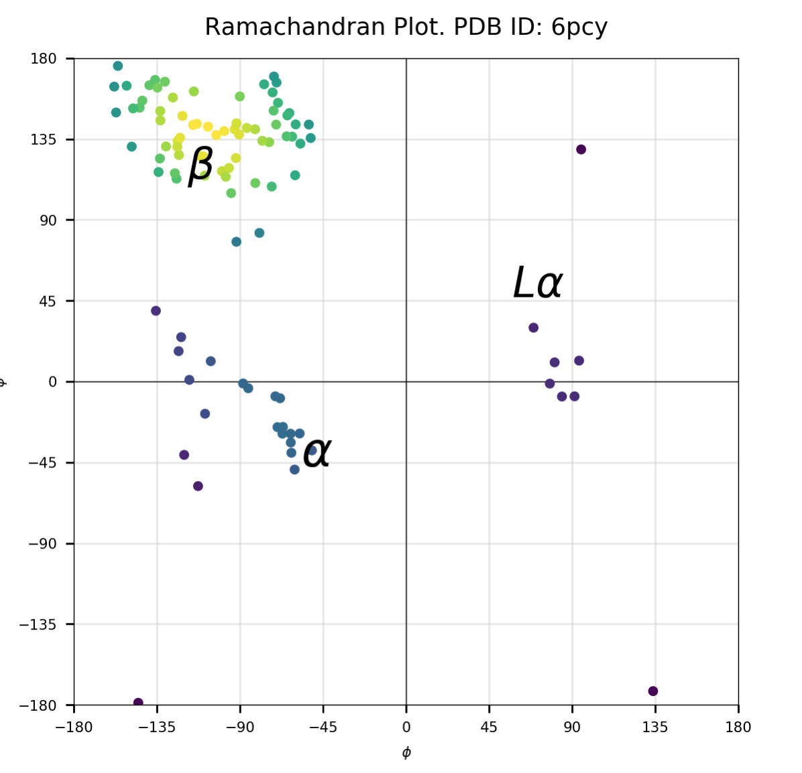

# Ramachandran Plots with python

Simple module to plot Ramachandran plots with python. It can extract torsion angles from pdb/cif files, plot Ram plots,
or fetch and save pdb files from Protein Data Bank by ID. The rest of the functionality is described in `torsion.py` docstrings. It's simple!

- `torsion/torsion.py` - main module with all needed functions
- `pdb_plot.ipynb` - example plots & description of Ramplot.

# Quick example

```python
from torsion import fetch_pdb, load_pdb
from torsion import phi_psi_angles, ram_plot

# fetch file from PDB and return as Structure object from biopython
pdb_struct = fetch_pdb("6PCY") 
# or simply load from file
pdb_struct = load_pdb("pdb_data/6pcy.cif")

# extract torsion angles
phi_angles, psi_angles = phi_psi_angles(pdb_struct)

# plot!
ram_plot(phi_angles, psi_angles, pdb_id="6PCY", density=True, secondary=True)
```



# Limitations

- in the current state it is possible to add contour on a plot with gaussian kde `contour=True`, but it's not the same as "core/not-core" or “core/allowed/generously allowed” regions
- no chain labels.